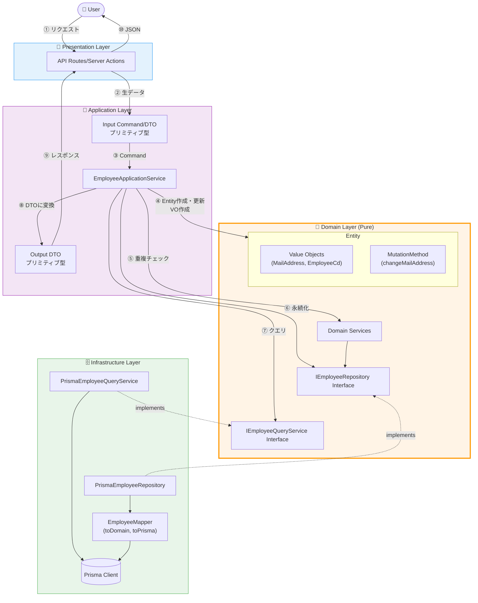
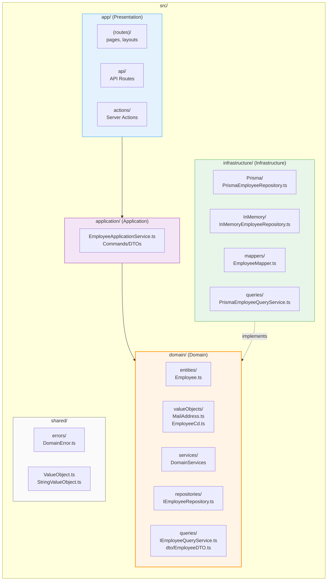
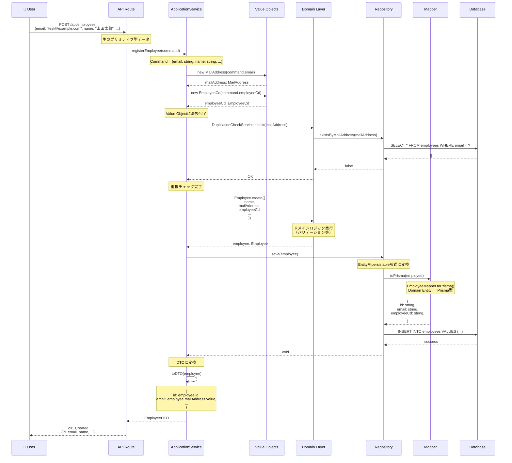
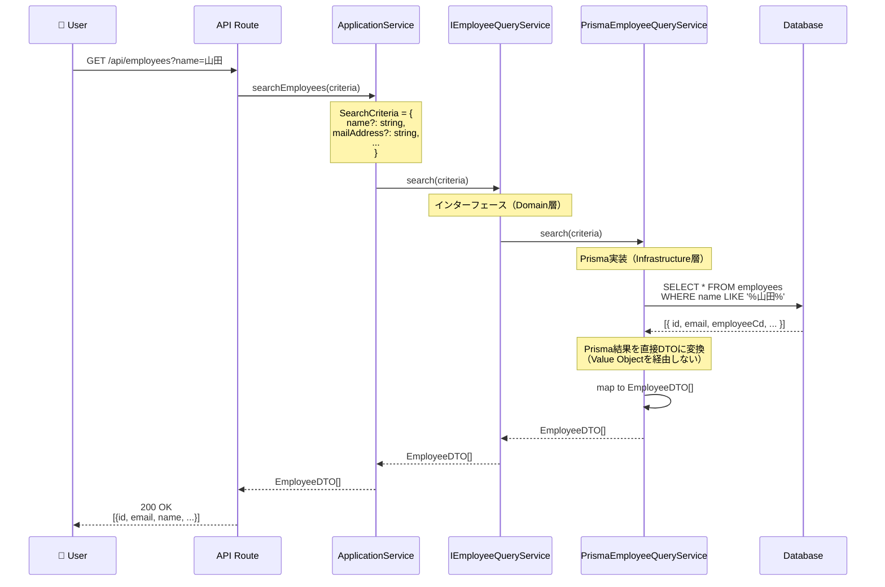
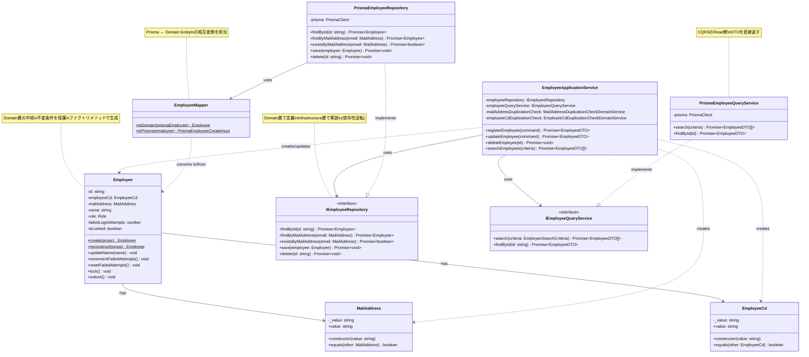

# DDD アーキテクチャ全体図

このドキュメントは、本プロジェクトの DDD（Domain-Driven Design）アーキテクチャ全体を可視化したものです。

## 目次

1. [レイヤードアーキテクチャ](#1-レイヤードアーキテクチャ)
2. [ディレクトリ構造マップ](#2-ディレクトリ構造マップ)
3. [データフロー図（Write 操作）](#3-データフロー図write操作)
4. [データフロー図（Read 操作 - CQRS）](#4-データフロー図read操作---cqrs)
5. [具体的なクラス構成](#5-具体的なクラス構成)

---

## 1. レイヤードアーキテクチャ

本プロジェクトは、4 層のレイヤードアーキテクチャを採用しています。

### 各層の責務

| 層                 | 責務                                                           | 依存方向                          |
| ------------------ | -------------------------------------------------------------- | --------------------------------- |
| **Presentation**   | ユーザーインターフェース、API、Server Actions                  | Application 層に依存              |
| **Application**    | ユースケース実行、トランザクション制御、DTO の変換             | Domain 層に依存                   |
| **Domain**         | ビジネスロジック、ドメインモデル（Entity、VO、Domain Service） | **他の層に依存しない**            |
| **Infrastructure** | データ永続化、外部サービス連携、Domain インターフェースの実装  | Domain 層のインターフェースを実装 |

**重要な原則：**

- Domain 層は他の層に依存しない（依存性逆転の原則）
- Infrastructure 層は Domain 層のインターフェース（`IEmployeeRepository`など）を実装
- Application 層は具象クラスではなく、インターフェースに依存

---

## 2. ディレクトリ構造マップ

### 主要ファイルの役割

| ファイルパス                                           | 役割                                                |
| ------------------------------------------------------ | --------------------------------------------------- |
| `domain/entities/Employee.ts`                          | Employee エンティティ（ビジネスロジックの中核）     |
| `domain/valueObjects/MailAddress.ts`                   | メールアドレスの Value Object（バリデーション含む） |
| `domain/repositories/IEmployeeRepository.ts`           | Repository インターフェース（Domain 層で定義）      |
| `domain/queries/IEmployeeQueryService.ts`              | Query Service インターフェース（CQRS）              |
| `application/EmployeeApplicationService.ts`            | ユースケース実行（VO 変換、トランザクション制御）   |
| `infrastructure/Prisma/PrismaEmployeeRepository.ts`    | Prisma を使った Repository 実装                     |
| `infrastructure/mappers/EmployeeMapper.ts`             | Prisma モデル ↔ Domain エンティティの変換           |
| `infrastructure/queries/PrismaEmployeeQueryService.ts` | Prisma を使った Query Service 実装                  |

---

## 3. データフロー図（Write 操作）

Employee 登録を例に、データがどのように変換されながら各層を流れるかを示します。

### データ変換の流れ

1. **API → Application**: プリミティブ型 → Command/DTO
2. **Application → Domain**: プリミティブ型 → Value Object（`MailAddress`, `EmployeeCd`）
3. **Application → Domain**: Value Object → Entity（`Employee.create()`）
4. **Domain → Infrastructure**: Entity → Prisma モデル（`EmployeeMapper.toPrisma()`）
5. **Infrastructure → DB**: Prisma モデル → DB レコード
6. **Application → Presentation**: Entity → DTO（プリミティブ型に戻す）
7. **Presentation → User**: DTO → JSON

---

## 4. データフロー図（Read 操作 - CQRS）

本プロジェクトでは、**CQRS（Command Query Responsibility Segregation）**パターンを採用しています。

- **Write（Command）**: Repository 経由で Entity 操作
- **Read（Query）**: Query Service 経由で DTO を直接取得

### CQRS の利点

| 操作      | 経路                         | 利点                                             |
| --------- | ---------------------------- | ------------------------------------------------ |
| **Write** | Repository → Mapper → Entity | ドメインロジックを確実に通す、整合性保証         |
| **Read**  | Query Service → DTO 直接     | パフォーマンス向上、不要なオブジェクト生成を回避 |

**重要：** Query 操作では Value Object や Entity を経由せず、直接 DTO を返すことでパフォーマンスを最適化しています。

---

## 5. 具体的なクラス構成

実際のプロジェクトで使用しているクラスとその関係を図示します。

### クラスの対応表

| クラス                       | 層             | ファイルパス                                                     |
| ---------------------------- | -------------- | ---------------------------------------------------------------- |
| `Employee`                   | Domain         | `src/domain/entities/Employee.ts`                                |
| `MailAddress`                | Domain         | `src/domain/valueObjects/MailAddress.ts`                         |
| `EmployeeCd`                 | Domain         | `src/domain/valueObjects/EmployeeCd.ts`                          |
| `IEmployeeRepository`        | Domain         | `src/domain/repositories/IEmployeeRepository.ts`                 |
| `IEmployeeQueryService`      | Domain         | `src/domain/queries/IEmployeeQueryService.ts`                    |
| `EmployeeApplicationService` | Application    | `src/application/EmployeeApplicationService.ts`                  |
| `PrismaEmployeeRepository`   | Infrastructure | `src/infrastructure/Prisma/Employee/PrismaEmployeeRepository.ts` |
| `EmployeeMapper`             | Infrastructure | `src/infrastructure/mappers/EmployeeMapper.ts`                   |
| `PrismaEmployeeQueryService` | Infrastructure | `src/infrastructure/queries/PrismaEmployeeQueryService.ts`       |

---

## まとめ

### 重要なポイント

1. **依存性逆転の原則**

   - Domain 層は他の層に依存しない
   - Infrastructure 層が Domain 層のインターフェースを実装

2. **データ変換の多段階性**

   - Write: プリミティブ → VO → Entity → Prisma モデル → DB
   - Read: DB → DTO（VO や Entity を経由しない - CQRS）

3. **CQRS 採用**

   - Command（Write）: Repository 経由
   - Query（Read）: Query Service 経由

4. **Mapper の役割**

   - Prisma モデルと Domain Entity の相互変換
   - Infrastructure 層に配置

5. **Value Object の重要性**
   - プリミティブ型をラップしてバリデーション
   - ドメインルールの保護

### 参考リンク

- プロジェクトルートの設計ドキュメント: `docs/system-design-doc.md`
- 開発ガイドライン: `docs/dev-guidelines.md`
- CLAUDE.md: プロジェクトの全体方針
