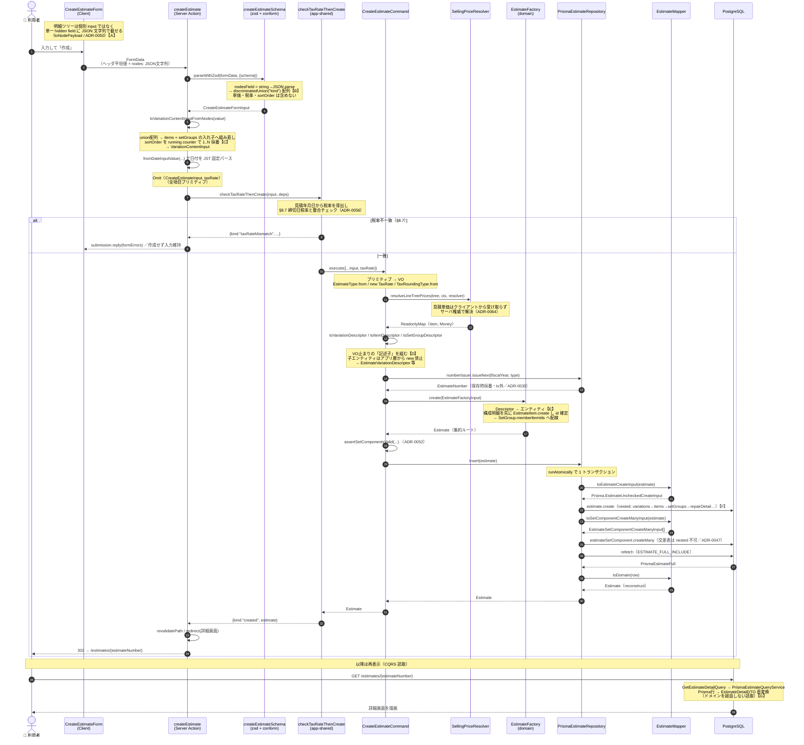

# C1: 見積 新規作成フロー

`/estimates/new` の統合フォーム（ヘッダー＋初期バリエーション1件）を送信してから、DB 永続化を経て詳細画面に再表示されるまでの、実際のメソッド呼び出しと型変換を追う。

- **入口**: `src/app/(features)/estimates/new/actions.ts` `createEstimate`（Server Action）
- **コマンド**: `CreateEstimateCommand.execute`
- **集約**: `Estimate`（ルート）/ `EstimateFactory.create`
- **永続化**: `PrismaEstimateRepository.insert`（nested write ＋ 交差表 createMany）

---

## シーケンス図



---

## 型変換の山場

`FormData` から `EstimateDetailDTO` まで、型は次のように姿を変える。#607 でイメージが付きにくかったのはこの経路。

```
FormData
  【B】 → parseWithZod(formData, {schema: createEstimateSchema})
       : CreateEstimateFormInput            [new/schema.ts / variationSchema.ts:70]
  【C】 → toVariationContentInputFromNodes(value)
       : VariationContentInput              [variationContentMapping.ts:23]
     → （+ 日付を fromDateInputValue で JST パース）
       : Omit<CreateEstimateInput,"taxRate">  [new/actions.ts:45]
     → checkTaxRateThenCreate(input, deps)
       : Promise<TaxCheckedCreateResult>     [checkTaxRateThenCreate.ts:29]
     → CreateEstimateCommand.execute(CreateEstimateInput)
       : Promise<Estimate>                   [CreateEstimateCommand.ts:145]
         ├ resolveLineTreePrices(...) : Promise<ReadonlyMap<item, Money>>  [resolveLinePrices.ts:100]
  【D】     └ toVariationDescriptor / toItemDescriptor
             : EstimateVariationDescriptor / EstimateItemDescriptor        [CreateEstimateCommand.ts:216/250]
  【E】 → EstimateFactory.create(EstimateFactoryInput)
       : Estimate                            [EstimateFactory.ts:154]
     → PrismaEstimateRepository.insert(Estimate)
       : Promise<Estimate>                   [PrismaEstimateRepository.ts:32]
  【F】     ├ toEstimateCreateInput(Estimate) : Prisma.EstimateUncheckedCreateInput   [EstimateMapper.ts:326]
        ├ toSetComponentCreateManyInput(Estimate) : ...CreateManyInput[]          [EstimateMapper.ts:384]
        └ toDomain(PrismaEstimateFull) : Estimate                                 [EstimateMapper.ts:106]
     → redirect(/estimates/{estimateNumber})
  【G】 → PrismaEstimateQueryService.toDTO(EstimateDetailRow)
       : EstimateDetailDTO                   [PrismaEstimateQueryService.ts:201]
```

### 【A】 明細ツリーは JSON 文字列で1フィールドに載せる

明細は行ごとの個別 input ではなく、単一 hidden field に `JSON.stringify(toNodePayload(nodes))` で載せる（ADR-0050）。`toNodePayload`（`variationLines.ts:355`）はクライアント専用キー（`rowId` / `productCode` / `isActive`）を落とし、スキーマ項目だけに絞る。

### 【B】 JSON 文字列 → 判別子 union 配列

`nodesField`（`variationSchema.ts:70`）が `z.string().transform(JSON.parse).pipe(z.array(nodeSchema))`。`nodeSchema` は `discriminatedUnion("kind", [lineNode, setGroupNode])` で、セット群は `components` に構成明細を**入れ子**で持つ。**単価・sortOrder はここに含めない**（単価はサーバ権威／ADR-0064、順序は配列順が真実）。

### 【C】 union 配列 → items + setGroups へ組み直し（sortOrder 採番）

`toVariationContentInputFromNodes`（`variationContentMapping.ts:23`）が union ノード配列を `items` と `setGroups` の入れ子構造へ組み直す。このとき **単一の running counter で通常明細・セット構成明細をノード出現順に 1..N 連番**して `sortOrder` を確定させる。**「平坦 → 入れ子」の組み直しが起きる中心地**。

### 【D】 プリミティブ → VO → Descriptor

アプリ層は子エンティティ（`EstimateVariation` / `EstimateItem` 等）を直接 `new` できない（eslint `no-restricted-imports` で禁止）。そこで **VO 止まりの「記述子（Descriptor）」** を組んで集約ファクトリに渡す。`EstimateItemDescriptor` / `EstimateSetGroupDescriptor` / `EstimateVariationDescriptor` は全て `EstimateFactory.ts` に定義。単価は `priceMap.get(item)` で引く（index 整合の壊れやすさを排除）。

### 【E】 Descriptor → エンティティ（集約ファクトリ）

`EstimateFactory.create`（`EstimateFactory.ts:154`）が Descriptor を受け取り子エンティティを構築。**構成明細を先に `EstimateItem.create` して id を確定 → その id を `EstimateSetGroup.memberItemIds` へ配線**する（会員解決）。集約ルート `Estimate.create` が「空見積不可（≥1バリ）」「variationNumber 重複禁止」「種別↔サブタイプ整合」を検証。

### 【F】 エンティティ → Prisma（nested write ＋ 交差表 createMany）

`insert`（`PrismaEstimateRepository.ts:32`）は `runAtomically` で1トランザクション。本体は `estimate.create` の**単一 nested write**（variations → items → setGroups → repairDetail…）。ただし**交差表 `EstimateSetComponent` だけは nested 不可**（兄弟の item 行を参照できない）ため、同一 tx 内で `createMany` する（ADR-0047）。採番だけは tx 外（欠番許容／ADR-0035）。

### 【G】 再表示は CQRS 読取（ドメインを経由しない）

詳細画面は `GetEstimateDetailQuery` → `PrismaEstimateQueryService.findByEstimateNumber` で、**Prisma 行 → `EstimateDetailDTO` に直変換**する。書き込みと違い集約（`Estimate`）を再構築しない CQRS 読み取り経路。単価乖離だけはアプリ層 `composeDivergences` で合成する。

---

## 関連 ADR

- ADR-0035: 採番は保存時 `MAX+1`（tx 外・欠番許容）
- ADR-0047: セット構成は交差表 `EstimateSetComponent`（nested write 不可）
- ADR-0050: 明細ツリーを単一 hidden field の JSON で送る
- ADR-0056: C1 の税率チェックは app-shared ラッパが所有（コマンドは純粋な組立器）
- ADR-0064: 見積単価はクライアントから受け取らずサーバ権威で解決
