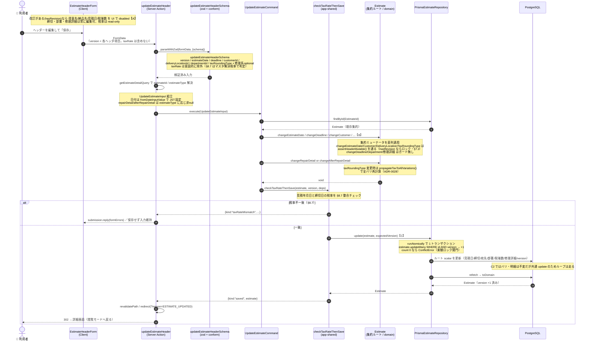

# C2: ヘッダー更新フロー

見積詳細画面のヘッダーを編集して保存するまで。**1本のまとまった Server Action `updateEstimateHeader`** に集約され（項目別の小さな action ではない）、集約ルートの複数ミューテータを1コマンドで直列適用する。税率チェックと永続化は C3/C4 と共有。

- **入口**: `[estimateNumber]/actions.ts` `updateEstimateHeader`（Server Action）
- **コマンド**: `UpdateEstimateCommand.execute`（複数の `change*` ミューテータを直列適用）
- **不変ガード**: `Estimate.assertHeaderMutable`（改訂が存在するとロック）
- **永続化**: `PrismaEstimateRepository.update`（C3/C4 と同じ差分 upsert）

> ⚠ **ADR-20260710-q7t との乖離に注意**（本ブランチ HEAD `752ce46c` 時点）。ADR は「見積年月日・宛先を作成後常に不変にし、`changeEstimateDate`/`changeCustomer`/`changeDeliveryLocation` を撤去、C2 を締切・部署・税端数・修理詳細の編集に縮小」を採用済みと宣言しているが、**コードにはまだ未適用**。この図は ADR の目標状態ではなく **現行コードの実態**を描いている。現行のロック条件は `hasRevision()`（改訂が存在するときだけロック）で、改訂前は見積年月日・得意先・納品先も変更可能。

---

## シーケンス図

---

## C1/C3/C4 との共有 / C2 固有差分

| 部品 | 共有範囲 | C2 の扱い |
|------|---------|-----------|
| `checkTaxRateThenSave`（`checkTaxRateThenSave.ts:28`） | C2/C3/C4 | そのまま共有 |
| `PrismaEstimateRepository.update` 差分 upsert | C2/C3/C4 | そのまま共有（C2 固有処理なし） |
| `handleCommandError` / `getEstimateDetailQuery` / `fromDateInputValue` | 全更新系 | そのまま共有 |
| 楽観ロック（version） | 全更新系（ADR-0039） | そのまま共有 |
| Server Action / スキーマ | — | **【C2固有】`updateEstimateHeader` / `updateEstimateHeaderSchema`（1本のヘッダ action）** |
| Command | — | **【C2固有】`UpdateEstimateCommand`（複数 `change*` を直列適用）** |
| 集約操作 | — | **【C2固有】ヘッダ scalar のミューテータ束（C3/C4 は scalar を触らない）** |
| 不変ガード | — | **【C2固有】`assertHeaderMutable`（hasRevision でロック）** |

### 【A】ロック対象は UI と domain の二重防御

改訂がある場合、フォームは得意先・納品先・見積年月日・税端数区分を `disabled` にする（`EstimateHeaderForm.tsx:82`）。ただし disabled でも hidden で送出されるため、真の防御は domain の `assertHeaderMutable`。締切・部署・修理詳細はロック対象外で常に編集可。

### 【B】複数ミューテータの直列適用（C2 の性格）

C2 は C3（1バリ追加）や C4（内容全置換）と違い、**ヘッダ scalar を触る複数のミューテータを1コマンドで順に適用**する。`changeEstimateDate` / `changeCustomer` / `changeDeliveryLocation` / `changeTaxRoundingType` は `assertHeaderMutable()` を通り、`changeDeadline` / `changeDepartment` / `changeRepairDetail` はガード無し（価格・税率に無関係なので改訂後も編集可）。

### 【C】永続化は C3/C4 と完全共有

C2 は専用メソッドを持たず、C3/C4 と同じ `Repository.update`（差分 upsert）を通る。実際に書き換わるのはルート scalar（`toEstimateScalarData`）中心で、バリ・明細は変化しないが共通経路のためループ自体は走る。version は `WHERE version = expectedVersion` の条件付き increment で bump。

---

## 関連 ADR

- ADR-0028: 税端数区分の変更は全バリエーションに伝播して再計算
- ADR-0039: 更新系は集約ルートの version で楽観ロック
- ADR-20260710-q7t: 見積年月日・宛先を作成後不変化（**採用済みだが本ブランチ未適用**。将来 C2 は締切・部署・税端数・修理詳細に縮小予定）
