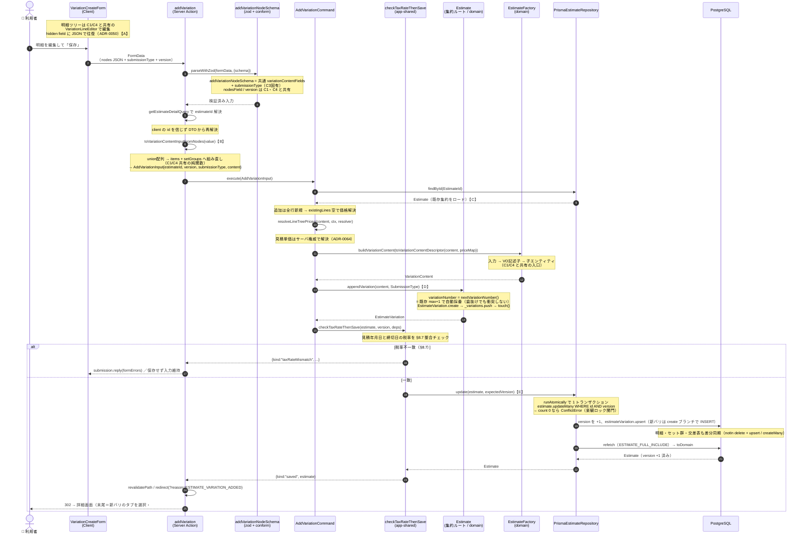

# C3: バリエーション追加フロー

見積詳細画面で「＋バリエーション追加」を押し、既存見積に1バリエーションを足して保存するまで。**C1（新規作成）とほぼ全部品を共有し、差分は「新規採番して既存集約に足す」点に集約される**。

- **入口**: `[estimateNumber]/actions.ts` `addVariation`（Server Action）
- **コマンド**: `AddVariationCommand.execute`
- **集約操作**: `Estimate.appendVariation`（max+1採番して既存集約に push）
- **永続化**: `PrismaEstimateRepository.update`（楽観ロック付き差分 upsert・新バリは create ブランチ）

> C1 との最大の構造差は、**C1 が集約を丸ごと新規生成して `insert` するのに対し、C3 は `findById` した既存集約に1件足して `update`（楽観ロック付き）する**点。明細の zod・変換・価格決定・記述子変換・ファクトリ入口はすべて C1 の共有部品を使い回す。

---

## シーケンス図

---

## C1 との共有 / C3 固有差分

| 部品 | 共有範囲 | C3 の扱い |
|------|---------|-----------|
| `nodesField`（`variationSchema.ts:70`） | C1/C3/C4 | そのまま共有 |
| `toVariationContentInputFromNodes`（`variationContentMapping.ts:23`） | C1/C3/C4 | そのまま共有 |
| `VariationLineEditor` / `useVariationLineEditor` | C1/C3/C4 | フォームラッパが `variationId` を持たず `SubmissionTypeField` を追加 |
| `resolveLineTreePrices`（`resolveLinePrices.ts:100`） | C1/C3/C4 | `existingLines` 空（全行新規解決） |
| `toVariationContentDescriptor`（`variationContentInput.ts:78`） | C3/C4 | そのまま共有 |
| `EstimateFactory.buildVariationContent`（`EstimateFactory.ts:240`） | C3/C4 | そのまま共有 |
| 税率チェック | — | **【C3固有】既存集約更新用ラッパ `checkTaxRateThenSave`（`checkTaxRateThenSave.ts:28`）** |
| 集約への反映 | — | **【C3固有】`Estimate.appendVariation`（`Estimate.ts:194`）＝ max+1 採番して push** |
| 永続化 | C2/C4 | **`Repository.update` 差分 upsert の create ブランチで新バリ INSERT（専用メソッドではない）** |
| version | — | 追加型でも必須（stale 集約による他人バリ削除防止・`AddVariationCommand.ts:24`） |

### 【A】明細編集 UI は C1/C4 と共有

`VariationLineEditor` ＋ `useVariationLineEditor` を作成・追加・更新で共有する。C3 のフォームラッパ `VariationCreateForm` は `variationId` を持たず、代わりに `SubmissionTypeField`（提出区分）を入力する点だけが差分。

### 【B】平坦 → 入れ子の組み直しも共有

`toVariationContentInputFromNodes`（`variationContentMapping.ts:23`）は C1 とまったく同じ関数。union ノード配列を `items` ＋ `setGroups` に分解し、`sortOrder` を配列出現順の running counter で 1..N 採番する（「平坦 → 入れ子」の中心地は C1 と同一）。

### 【C】既存集約のロード（C1 との分岐点）

C1 は `EstimateFactory.create` で集約を新規生成するが、C3 は `estimateRepository.findById` で既存集約をロードしてから追加する。ここが構造上の最大の差分。

### 【D】`appendVariation` で max+1 採番

`Estimate.appendVariation`（`Estimate.ts:194`）が `nextVariationNumber()`（`Estimate.ts:626`）で **既存の最大 variationNumber + 1** を採番する。歯抜け番号があっても衝突しない max+1 方式（§A.2）。番号重複は `assertNoVariationNumberDuplication` で二重に検証。

### 【E】楽観ロック付き差分 upsert

C3 は専用の insert ではなく汎用 `update`（C2/C4 と同一の差分 upsert）を通る。`estimate.updateMany({ where: { id, version: expectedVersion } })` で version を +1 しつつ、`count === 0`（他者が先に更新）なら `ConflictError`。新バリは各バリ upsert の **create ブランチで INSERT** され、集約から消えたバリだけ `notIn` で delete される。

---

## 関連 ADR

- ADR-0039: 更新系は集約ルートの version で楽観ロック（hidden トークン往復）
- ADR-0045: 提出区分はバリエーション単位・作成時確定の不変属性
- ADR-0050: 明細ツリーを単一 hidden field の JSON で送る（C1 と共有）
- ADR-0064: 見積単価はクライアントから受け取らずサーバ権威で解決（C1 と共有）
