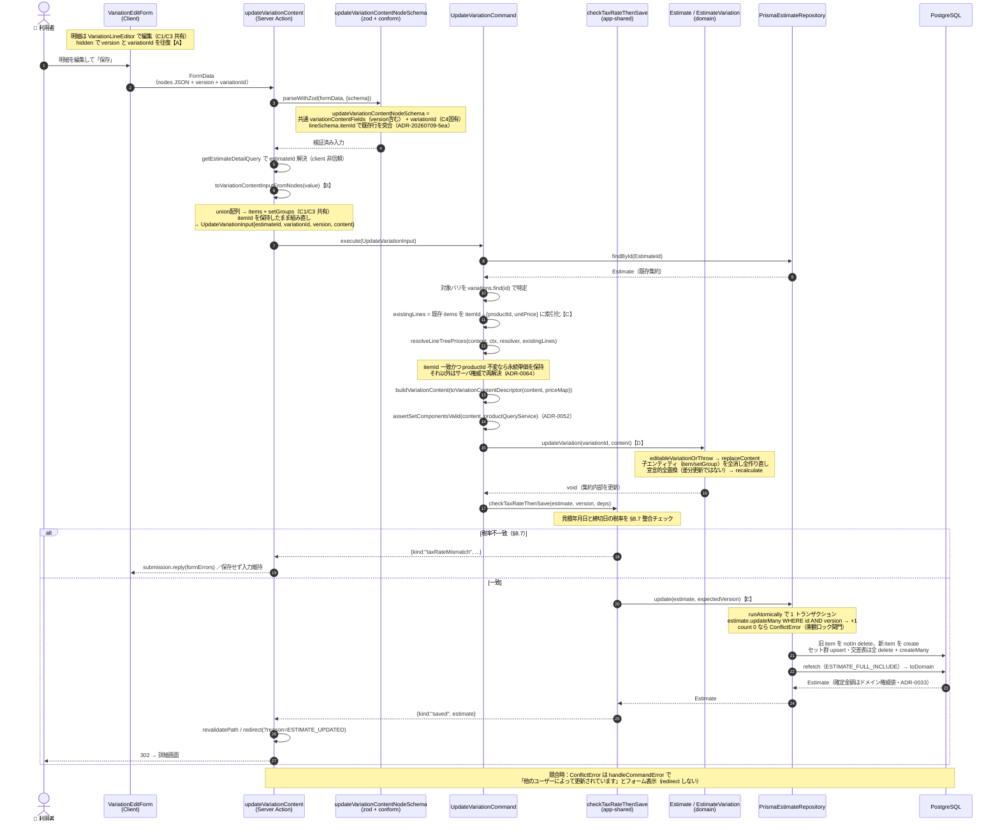

# C4: バリエーション内容更新フロー

見積詳細画面で既存バリエーションの明細ツリー（明細・セット群・値引・メモ）を編集して保存するまで。**C1/C3 と部品をほぼ共有し、C4 固有の差分は 3 点** — (a) `version` 照合による楽観ロック、(b) 既存内容の全置換（`replaceContent`）、(c) `itemId` 突合による永続単価の保全。

- **入口**: `[estimateNumber]/actions.ts` `updateVariationContent`（Server Action）
- **コマンド**: `UpdateVariationCommand.execute`
- **集約操作**: `Estimate.updateVariation` → `EstimateVariation.replaceContent`（子エンティティを全消し全作り直し）
- **永続化**: `PrismaEstimateRepository.update`（C3 と同じ差分 upsert）

---

## シーケンス図

---

## C1/C3 との共有 / C4 固有差分

| 部品 | 共有範囲 | C4 の扱い |
|------|---------|-----------|
| `nodesField` / `toVariationContentInputFromNodes` | C1/C3/C4 | そのまま共有（`itemId` を保持） |
| `VariationLineEditor` / `useVariationLineEditor` | C1/C3/C4 | フォームが `version` と `variationId` を hidden 往復 |
| `variationContentFields`（version 含む） | C3/C4 | スキーマに `variationId` を追加（C3 は `submissionType`） |
| `resolveLineTreePrices`（`resolveLinePrices.ts:100`） | C1/C3/C4 | **`existingLines` を渡す**（C1/C3 は空） |
| `toVariationContentDescriptor` / `buildVariationContent` | C3/C4 | そのまま共有 |
| `checkTaxRateThenSave` | C2/C3/C4 | そのまま共有 |
| `Repository.update` 差分 upsert | C2/C3/C4 | そのまま共有 |
| 集約への反映 | — | **【C4固有】`Estimate.updateVariation` → `replaceContent`（全置換）** |
| 単価保全 | — | **【C4固有】`itemId` 突合で永続単価を保持（ADR-20260709-5ea）** |

### 【A】明細編集 UI は共有、往復トークンが固有

明細編集は C1/C3 と同じ `VariationLineEditor`。C4 固有は **hidden で `version`（楽観ロックトークン）と `variationId`（更新対象）を往復**させる点。初期値は閲覧 DTO（`VariationDTO`）を `fromVariationLines` でノード union へ写して供給する。

### 【B】組み直しは共有、`itemId` を保持

`toVariationContentInputFromNodes` は C1/C3 と同一関数。ただし C4 では `lineSchema.itemId`（`variationSchema.ts:17`）で既存行のキーを持ち回り、`toItemInput` 経由で保持する。これが後の単価保全【C】の突合キーになる。

### 【C】`itemId` 突合による永続単価の保全（C4 固有の肝）

コマンドが対象バリの既存 `items` を `itemId → {productId, unitPrice}` の Map（`existingLines`）に索引化し、`resolveLineTreePrices` に渡す。`preservedPriceFor`（`resolveLinePrices.ts:118`）が **`itemId` 一致かつ `productId` 不変なら価格決定を呼ばず永続単価をそのまま返す**。行を触っていないのに単価がマスタ現在値で上書きされるのを防ぐ。C1/C3 は `existingLines` を渡さないため常に再解決する。

### 【D】`replaceContent` による宣言的全置換

`Estimate.updateVariation`（`Estimate.ts:297`）→ `EstimateVariation.replaceContent`（`EstimateVariation.ts:320`）が **子エンティティ（item/setGroup）を全消し全作り直し**する。ドメインは差分更新ではなく「新しい内容セットで宣言的に全置換」する（`_items.length = 0; _items.push(...)`）。改訂先（行構成固定・§7.2）や無効状態は `assertLineStructureMutable` / `assertEditable` でガード。

### 【E】永続化は delete + 再 create として現れる

ドメインが全置換 → 全 item が新 id を持つため、`Repository.update` では旧行が `notIn` delete、新行が create される（実質 delete + 再 create）。セット群ヘッダは被参照のため identity 保持の upsert、交差表 `EstimateSetComponent` は全 delete → createMany で作り直す（ADR-0047）。version は `WHERE version = expectedVersion` の条件付き increment で bump（`count === 0` → `ConflictError`）。

---

## 関連 ADR

- ADR-0033: 確定金額はドメイン権威値で再表示時に上書き
- ADR-0039: 更新系は集約ルートの version で楽観ロック
- ADR-0052: セット構成のライブ区分・有効性検証はアプリ層（集約越え）
- ADR-20260709-5ea: 既存行は `itemId` で突合し、触っていない行の永続単価を保全
- ADR-0064: 見積単価はサーバ権威で解決（C1 と共有）
