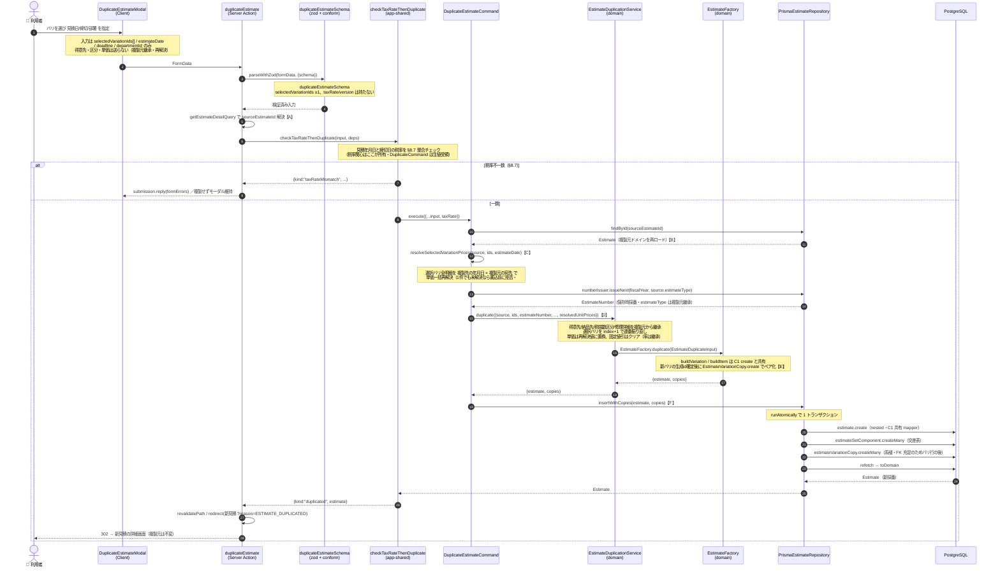

# C6: 見積複製フロー

複製元の詳細画面からモーダルを開き、選択したバリエーションを複写して新見積を作るまで。ヘッダ項目（見積区分・得意先・納品先・税端数区分・提出区分・修理詳細）は複製元から**継承**し、選択バリの単価は複製先条件で**再解決**、複製系譜（`EstimateVariationCopy`）を記録する。

- **入口**: `[estimateNumber]/actions.ts` `duplicateEstimate`（Server Action・モーダル）
- **コマンド**: `DuplicateEstimateCommand.execute`
- **複製ロジック**: `EstimateDuplicationService.duplicate` → `EstimateFactory.duplicate`（`{estimate, copies}` を返す）
- **永続化**: `PrismaEstimateRepository.insertWithCopies`（本体 nested write + 系譜 createMany）

> C1（新規作成）と保存の骨格（`EstimateFactory` の子構築・`insert` 系・採番）を共有しつつ、C6 固有は「複製元ロード → 継承合成 → 単価再解決 → 系譜ペア化 → `insertWithCopies`」。

---

## シーケンス図

---

## C1 との共有 / C6 固有差分

| 部品 | 共有範囲 | C6 の扱い |
|------|---------|-----------|
| `EstimateFactory`（`buildVariation`/`buildItem`/`buildSetGroups`/`assembleEstimate`/`Estimate.create`） | C1/C6 | そのまま共有（`duplicate` が内部で呼ぶ） |
| `EstimateMapper.toEstimateCreateInput` / `toSetComponentCreateManyInput` | C1/C6 | そのまま共有 |
| `PrismaEstimateNumberIssuer.issueNext` 採番 | C1/C6 | そのまま共有（estimateType は複製元継承） |
| `TaxRateConsistencyCheckDomainService` | 全作成/更新系 | 複製用ラッパ `checkTaxRateThenDuplicate` から呼ぶ |
| 入口の id 解決 | — | **【C6固有】`getEstimateDetailQuery` で `sourceEstimateId` を取得** |
| 複製元ロード | — | **【C6固有】`findById` でドメイン集約を再ロード** |
| 単価 | — | **【C6固有】複製先条件で再解決（クリアではない・#431）** |
| 複製ロジック | — | **【C6固有】`EstimateDuplicationService.duplicate` / `EstimateFactory.duplicate`** |
| 系譜 | — | **【C6固有】`EstimateVariationCopy` を生成し `insertWithCopies` で記録** |

### 【A】入口で複製元 id を解決

`duplicateEstimate` Server Action は `getEstimateDetailQueryFactory().execute` で複製元 DTO を引き、`dto.estimateId` を `sourceEstimateId` として渡す（client の値を信頼しない）。これはアプリ層の複製元再ロード【B】とは別の入口固有処理。

### 【B】複製元ドメインの再ロード

`DuplicateEstimateCommand.execute` は `estimateRepository.findById(new EstimateId(sourceEstimateId))` で **複製元の集約を再ロード**する。継承項目（得意先・納品先・区分・修理詳細）と選択バリの明細はここから取る。

### 【C】単価は「クリア」ではなく複製先条件で再解決

当初設計の「単価クリア」は #431 / ADR-20260710-q7t で撤去済み。現在は `resolveSelectedVariationPrices` が **複製先の見積年月日 × 複製元の宛先（得意先・納品先）** で選択バリ全明細の単価を一括再解決する。1 件でも未解決なら 0 円にせず、商品名を列挙して書き込み前に拒否する。クリアされるのは固定値引（`itemDiscount` / `overallDiscount`）のみで、率（`discountRate`）は継承。

### 【D】継承合成と連番振り直し

`EstimateDuplicationService.duplicate`（`EstimateDuplicationService.ts:76`）が継承項目を合成し、選択バリを `index + 1` で複製先の連番に振り直す。`toCopiedDescriptor` は各バリに `sourceVariationId`（系譜のため）を添え、`submissionType` はバリ単位で継承する（ADR-0045）。

### 【E】系譜のペア化（生成 id 確定後）

`EstimateFactory.duplicate`（`EstimateFactory.ts:175`）は子エンティティ構築（C1 と共有の `buildVariation`）で **新バリの id が確定してから**、`EstimateVariationCopy.create(新バリ.id, sourceVariationId)` でペアを作る。戻り値は C1 の `Estimate` 単体と違い `{ estimate, copies }`。

### 【F】本体と系譜を同一トランザクションで保存

`insertWithCopies`（`PrismaEstimateRepository.ts:58`）が `runAtomically` の 1 トランザクションで、本体を `estimate.create`（C1 共有の nested write）→ 交差表 createMany →**系譜 `estimateVariationCopy.createMany`** の順に書く。系譜は `copiedVariationId` の FK を満たすためバリ行生成の後に実行する。

---

## 関連 ADR

- ADR-0041: 複製系譜 `EstimateVariationCopy` はサロゲート id を持たず自然キー
- ADR-0042: 複製は最低 1 バリエーションの選択を要求（空見積不可）
- ADR-0045: 提出区分はバリエーション単位で継承
- ADR-0057: 複製 UI は複製元詳細のモーダル、`DuplicateEstimateCommand` を駆動
- ADR-20260710-q7t / #431: 単価はクリアではなく複製先条件で再解決
