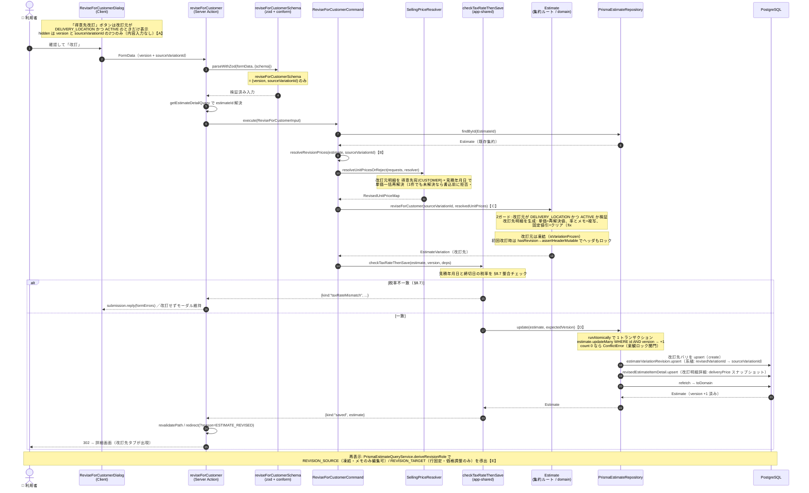

# C7: 得意先改訂フロー

「納品先宛・ACTIVE」の既存バリエーション（改訂元）から、**同一集約内に**「得意先宛」の新バリエーション（改訂先）を1つ生成する。C6 複製と違い集約またぎ・採番なしで、同一集約の `update` で完結する。**利用者の内容入力は一切なく**（入口は改訂元ID + version のみ）、改訂先の内容はドメインが全決定する。

- **入口**: `[estimateNumber]/actions.ts` `reviseForCustomer`（Server Action・モーダル）
- **コマンド**: `ReviseForCustomerCommand.execute`（単価再解決 → `reviseForCustomer`）
- **集約操作**: `Estimate.reviseForCustomer`（改訂先を生成し max+1 採番、改訂元を凍結）
- **永続化**: `PrismaEstimateRepository.update`（C2/C3/C4 と共有・改訂明細詳細と系譜を差分同期）

> 改訂先の生成規則: **単価は得意先宛 × 見積年月日で価格マスタから再解決**（#431）。**率（`discountRate`）とメモは複写**、**固定値引（`itemDiscount` / `overallDiscount`）はクリア**（fix #600 / ADR-20260714-pv8）。**行構成・数量は固定**（改訂先は明細の追加/削除/全置換/数量変更が禁止）。各改訂先明細は改訂元の `finalAmount` を `deliveryPrice` としてスナップショット保持（粗利の真実の源・§8.4）。

---

## シーケンス図

---

## 共有 / C7 固有差分

| 部品 | 共有範囲 | C7 の扱い |
|------|---------|-----------|
| `checkTaxRateThenSave` | C2/C3/C4/C7 | そのまま共有 |
| `PrismaEstimateRepository.update` 差分 upsert | 全更新系 | 改訂明細詳細・系譜の同期を追加で通す |
| 単価再解決 `resolveUnitPricesOrReject` / `toSellingPriceTarget` | C1/C6/C7 | 宛先を CUSTOMER で組む |
| `EstimateVariation.create` / `nextVariationNumber` max+1 採番 | C3/C6/C7 | そのまま共有 |
| 改訂明細詳細 | — | **【C7固有】`RevisedEstimateItemDetail`（`deliveryPrice` スナップショット）＋ `revisedEstimateItemDetail` テーブル** |
| 集約操作 | — | **【C7固有】`Estimate.reviseForCustomer`（採番あり・集約内完結・内容全決定）** |
| 行構成/数量固定 | — | **【C7固有】`assertLineStructureMutable` / `assertQuantityImmutable`（`revisedFrom != null`）** |
| 固定値引 | — | **【C7固有】複写せずクリア（fix #600）。率のみ継承** |

### 【A】入力は改訂元ID + version のみ（内容入力なし）

C3/C6 と違い、利用者はフォームに明細も日付も部署も入れない。hidden で送るのは `version`（楽観ロックトークン）と `sourceVariationId`（改訂元）の2つだけ。改訂先の内容はドメインが全決定する。ボタン表示ゲート `isVariationRevisableForCustomer`（`DELIVERY_LOCATION && ACTIVE`）はドメイン2ガードの UI 側の写し。

### 【B】単価は得意先宛で再解決

`resolveRevisionPrices` が改訂元明細を `submissionType: CUSTOMER`・見積年月日で組み、`resolveUnitPricesOrReject` で一括再解決する。改訂元単価は引き継がない。1明細でも未解決なら 0 円にせず商品名を列挙して書き込み前に拒否。C1 の明細生成・C6 の複製先単価と同じ価格解決基盤を宛先違いで使う。

### 【C】改訂先の生成規則（固定値引クリアが fix #600 の本体）

`Estimate.reviseForCustomer`（`Estimate.ts:229`）が改訂先バリを生成する:
- **単価** = 再解決値（`resolvedRevisedUnitPriceOrThrow`）
- **率（`discountRate`）・メモ** = 改訂元から複写
- **固定値引（`itemDiscount` / `overallDiscount`）** = **クリア**（付与しない）
- **`revisedDetail`** = `RevisedEstimateItemDetail.create(改訂元の finalAmount)` で粗利スナップショット
- `variationNumber` = `nextVariationNumber()`、`submissionType` = `CUSTOMER`、`revisedFrom` = 改訂元 id

> **fix #600 の背景**: 以前は固定値引を改訂元から複写していたため、単価再解決で得意先単価が値引額を下回ると値引後金額が負になり、負値ガードが throw して**有効な見積が改訂不能**になっていた（#598）。絶対額の値引は改訂元単価を基準に決めた譲歩額で、単価再解決で根拠を失うためクリアする（ADR-20260714-pv8）。率は基準が変わっても意味を保つので複写維持。これで複製（C6）と「単価再解決を伴う生成は率のみ継承・絶対額は持ち込まない」で対称化された。

### 【D】改訂元の凍結と行構成固定

改訂先が存在すると改訂元は `isVariationFrozen` で凍結され、内容編集・削除が禁止（メモのみ ADR-0059 で貫通）。初回改訂時は `hasRevision()` → `assertHeaderMutable()` で見積ヘッダー（見積年月日・宛先・税率・税端数）もロックされる（C2 のロック条件と同じ関門）。改訂先自身は `assertLineStructureMutable`（`revisedFrom != null`）で明細追加・削除・全置換（C4）が、`assertQuantityImmutable` で数量変更が禁止される。許可される編集は `adjustPricing`（掛率・明細値引・全体値引・メモのみ）に限定。

### 【E】再表示は RevisionRole で役割を導出

読み取り側 `PrismaEstimateQueryService.deriveRevisionRole` が、改訂系譜から各バリの `RevisionRole`（`NONE` / `REVISION_SOURCE` / `REVISION_TARGET`）を導出する。UI は `REVISION_SOURCE`（改訂元・凍結）にはメモ編集のみ、`REVISION_TARGET`（改訂先・行固定）には「価格を調整」を出す。

---

## 関連 ADR

- ADR-0044: 改訂先を削除すると系譜ごと消え、改訂元の凍結が自動的に解ける
- ADR-0059: 凍結された改訂元でもメモは編集可能（貫通）
- ADR-0060: 改訂先は数量固定（粗利スナップショット保全）
- ADR-20260714-pv8 / fix #600: 単価再解決を伴う生成では固定値引をクリア（率のみ継承）
- #431: 単価はクリアではなく宛先・年月日で再解決
